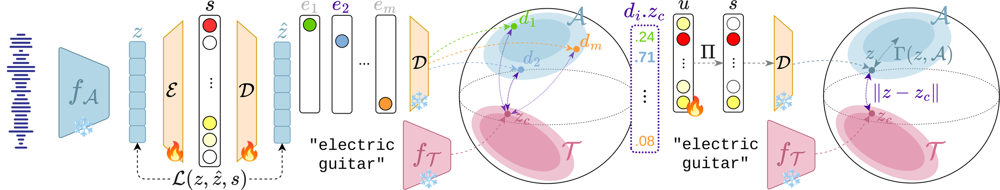
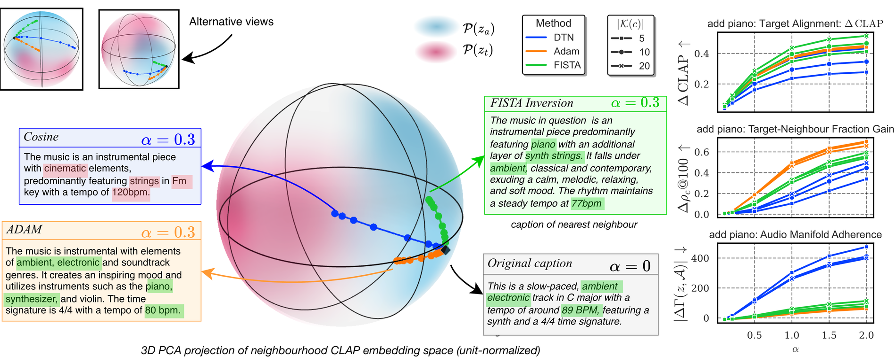
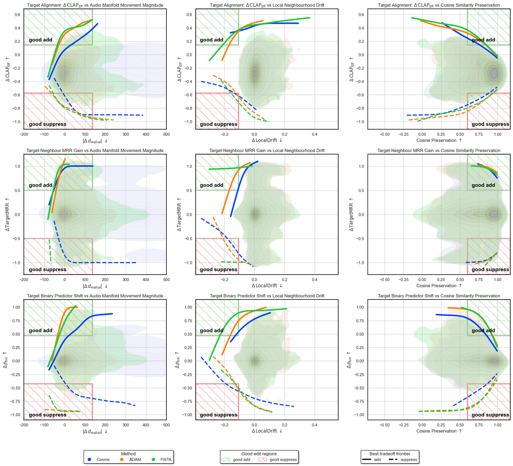

<div align="center">

# Sparse Steerable Retrieval

### Steering dense music retrieval with open-vocabulary concept discovery

**Julien Guinot<sup>1,2</sup>, Alain Riou<sup>2</sup>, Elio Quinton<sup>2</sup>, György Fazekas<sup>1</sup>**
<sup>1</sup> Centre for Digital Music, Queen Mary University of London, U.K.
<sup>2</sup> Music & Audio Machine Learning Lab, Universal Music Group, London, U.K.

Accepted to **ISMIR 2026**

[](LICENSE)
[](https://ismir2026.ismir.net/)
[](https://huggingface.co/Pliploop/steerable-retrieval-sae)
[](https://pliploop.github.io/sparse-steer-retrieval/)
[](https://huggingface.co/spaces/Pliploop/steerable-retrieval)



</div>

---

## TL;DR

Dense music retrieval embeds tracks into a shared space and retrieves by similarity, but gives
you **no control** over *specific* attributes: you can't ask for results that are *more ambient*,
*less distorted*, or *without guitar* while keeping everything else about a seed query.

**Sparse steerable retrieval** adds that control. We train a sparse autoencoder (SAE) on the audio
embeddings of a joint music–text encoder (MuQ-MuLan), then edit a query along a **free-form text
concept** by amplifying or suppressing the sparse features that carry it, before nearest-neighbour
search.

The core contribution is **how to find those features**. Instead of *Discover-Then-Name* (DTN)
cosine probing — picking the decoder atom most aligned with the concept's text embedding — we cast
concept attribution as a **sparse inversion problem**: recover a sparse code whose decoded embedding
*reconstructs* the concept while staying on the audio manifold. Inversion-derived supports are more
faithful to how the concept actually appears in audio, and give a strictly better
controllability–preservation trade-off.

---

## Highlights

- **Open-vocabulary control** — steer retrieval with any free-form text concept; no fixed tag vocabulary.
- **Training-free attribution** — sparse inversion needs no SAE retraining and no paired audio–text data.
- **Two solvers** — `adam` (general, differentiable) and `fista` (fast linear inverse, ~20 ms/CPU for the live demo).
- **A sleek API** — build a `Slider` for a concept, then `.steer()` / `.retrieve()`.
- **Audio-faithful** — inversion supports overlap real audio supports far better than cosine probing (bundle hit-rate ↑, probe AUROC ~50% → ~65–80%).

---

## What's in this repo

```
steerable_retrieval/
  steer/            # the public API: sparse inversion, steering, retrieval, Slider
  models/sae/       # SAE encoders (BatchTopK/TopK/JumpReLU/…), decoders, penalties
  models/encoders/  # MuQ-MuLan and CLAP audio/text towers
  dataloading/      # datasets + datamodule (raw audio or pre-extracted embeddings)
  train.py          # Hydra/Lightning training entry point
configs/            # Hydra configs (model, data, experiment, trainer, …)
scripts/            # SLURM launchers for training
tests/              # pytest suite for the steering API
```

> The import package is `steerable_retrieval`; the PyPI distribution name is `steerable-retrieval`.

---

## Installation

```bash
git clone https://github.com/Pliploop/sparse-steer-retrieval.git
cd sparse-steer-retrieval

# core steering API (torch + numpy)
pip install -e .

# to use the released MuQ-MuLan model for concept text encoding
pip install -e ".[muq]"

# for training / evaluation (Hydra + Lightning + Dora + encoders)
pip install -e ".[train]" -r requirements.txt
```

Python ≥ 3.10.

---

## Quickstart — the `Slider` API

A `Slider` binds a text concept to a sparse edit direction (found by inversion) in a trained SAE.
Once built, it steers any query embedding along the concept axis and retrieves over a corpus.

```python
from steerable_retrieval.steer import Slider

# `model` is a trained SAE exposing .sae_encoder / .sae_decoder / .text_encoder.
# The Mahalanobis manifold prior ships with the library — no data needed to build a slider.

slider = Slider(
    "distorted electric guitar",
    model=model,
    method="adam",   # or "fista" for the fast solver
    K=10,            # cap the concept support to its top-10 features
)

z = corpus[0]                              # a seed query embedding
z_more_guitar = slider.steer(z, alpha=1.0) # alpha > 0 amplifies; alpha < 0 suppresses
z_less_guitar = slider.suppress(z, 1.0)

# steer, then retrieve nearest neighbours over *any* corpus (independent of the prior)
idx, scores = slider.retrieve(z, corpus, alpha=1.0, k=10, exclude_idx=0)

print(slider)              # Slider(concept='distorted electric guitar', method='adam', |support|=10, …)
print(slider.support)      # indices of the concept's sparse features
```

The **manifold prior** is a fixed distributional constant of the audio space, fit once on Music4All
and packaged with the library — it is independent of whatever corpus you retrieve over. To adapt it
to your own data, opt in with `slider.fit_prior(embeddings)`. Passing `audio_embeddings=` only seeds
the Adam inversion from the nearest audio neighbour; it does not change the prior.

Once the pretrained checkpoint is released you'll be able to skip the model wiring entirely:

```python
slider = Slider("distorted electric guitar")   # resolves the default model + checkpoint
```

Reuse one loaded `model` across many concepts — building a `Slider` is just an inversion, not a model load.

---

## How it works

<div align="center"></div>

1. **Train an SAE** on audio embeddings from a joint music–text encoder. The sparse code exposes
   localized, more interpretable directions in the embedding space.
2. **Attribute a concept by inversion.** Given a concept's text embedding `z_c`, solve for a sparse
   code `u*` whose decoded embedding reconstructs `z_c` under cosine distance, regularized by a
   Mahalanobis prior that keeps the solution near the empirical audio distribution. IDF-weighting
   suppresses generic "hub" neurons. This yields the concept's **support** — the slider.
3. **Steer & retrieve.** Amplify (`s + α·u*`) or suppress (`max(0, s − α·u*)`) the support in the
   query's sparse code, decode back to the dense space, L2-normalize, and do nearest-neighbour search.

DTN cosine probing selects a single text-aligned atom; because of the modality gap and feature
splitting, that atom often is *not* the one active for audio examples of the concept. Inversion
selects the set of features that **jointly** realize the concept in the audio dictionary.

---

## Results

At matched support size and edit strength, inversion produces **stronger, more manifold-faithful
edits** than DTN cosine probing, dominating the edit–preservation Pareto frontier for both concept
amplification and suppression.

<div align="center"></div>

- **Support faithfulness** — inversion supports overlap the sparse supports of positive audio
  examples far more than cosine-probed ones (higher bundle recall and hit-rate).
- **Informativeness** — a weak probe restricted to the recovered neurons goes from ~50% AUROC
  (cosine) to ~65–80% (inversion).
- **Retrieval editing** — at matched off-target drift / modality adherence, inversion achieves
  larger target-concept gains; both variants stay markedly closer to the audio manifold.

See the [citation](#citation) for the current publication record; arXiv / DOI details will be added when public.

---

## Reproducing the paper / training your own model

The main model is a **BatchTopK SAE** (expansion factor 8, `dict_size=4096`) trained on
**MuQ-MuLan** audio embeddings of **music4all**, audio-only, over a sparsity sweep
`L0 ∈ {5, 10, 20, 50, 100}`.

### Train on pre-extracted embeddings

Training is a single Hydra command — pick the sparsity with `model.sae_encoder.top_k`:

```bash
python steerable_retrieval/train.py \
  experiment=train_music4all_muq_batchtopk \
  model.sae_encoder.top_k=10
```

Sweep the sparsity grid by running it once per `top_k` (5, 10, 20, 50, 100). The
[experiment config](configs/experiment/train_music4all_muq_batchtopk.yaml) trains audio-only
(`data_mixing_ratio=0.0`) with identity encoders (features are pre-extracted, so no encoder is
loaded during training). Point [`configs/data/music4all.yaml`](configs/data/music4all.yaml) at your
embedding manifest.

**On a SLURM cluster**, `scripts/launch_music4all_sweep.sh` submits the whole grid as separate
single-GPU jobs (`PROFILE=sae` or `PROFILE=andrena`); `TOP_KS="10" scripts/launch_music4all_sweep.sh`
runs just the main model.

### Produce your own dataset

To steer over *your* music, extract MuQ-MuLan audio embeddings (512-d, one per clip) and write an
embedding manifest (a CSV mapping each clip to its `.npy` path, split, and caption). Feature
extraction lives in [`steerable_retrieval/extract_dataset.py`](steerable_retrieval/extract_dataset.py) with configs under
[`configs/extract_features/`](configs); then train exactly as above by pointing the data config at
your manifest.

---

## Companion website & live demo

- **Companion website** — <https://pliploop.github.io/sparse-steer-retrieval/> with the project overview,
  intuitive diagrams, and the explainer video.
- **Live demo** — <https://huggingface.co/spaces/Pliploop/steerable-retrieval> for open-vocabulary
  steerable retrieval over the music4all corpus: pick a track, type a concept, move the slider.
- **Model checkpoints** — <https://huggingface.co/Pliploop/steerable-retrieval-sae>.

---

## Tests

```bash
pip install -e ".[test]"
pytest tests/
```

The suite exercises the full steering API (inversion, mask construction, steering semantics,
retrieval) on a small synthetic SAE.

---

## Citation

```bibtex
@inproceedings{guinot2026steering,
  title     = {Steering dense music retrieval with open-vocabulary concept discovery},
  author    = {Guinot, Julien and Riou, Alain and Quinton, Elio and Fazekas, Gy{\"o}rgy},
  booktitle = {Proceedings of the 27th International Society for Music Information Retrieval Conference (ISMIR)},
  year      = {2026}
}
```
<!-- TODO: update with final pages / DOI once published -->

---

## License

MIT — see [LICENSE](LICENSE).

## Acknowledgments

We thank the authors of [MuQ-MuLan](https://github.com/tencent-ailab/MuQ) and
[CLAP](https://github.com/LAION-AI/CLAP) for their pretrained audio–text encoders.
